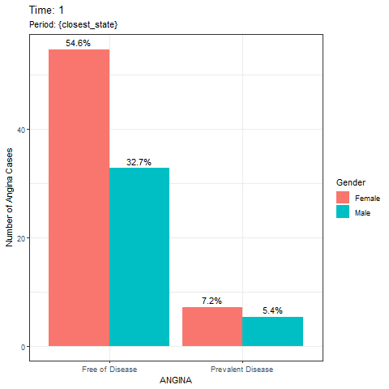

```{r setup, include=FALSE}
knitr::opts_chunk$set(echo = TRUE)
# setwd(file.path("C:", "Users", "elwoo", "Desktop", "University", "AMED3002"))
setwd("~/Desktop/University/AMED3002/")
frmgham_data <- read.csv("frmgham.csv", header = TRUE)
library(ggplot2)
library(gganimate)
library(gifski)
```

## **Framingham Heart Study**


## Abstract {#abstract}
A data analysis report was conducted and written based on a Framingham study, where data 
was collected in 1968. It was determined that in the living subjects in the community of 
Framingham, Massachusetts, females have a higher systolic blood pressure in comparison 
to males as of the year 1968.


## Introduction {#introduction}
```{r, echo = FALSE}
frmgham_data$SEX <- sapply(frmgham_data$SEX, 
                           function(x) switch(as.character(x),
                                              "1" = "Male",
                                              "2" = "Female"))
frmgham_data$ANGINA <- sapply(frmgham_data$ANGINA, 
                           function(x) switch(as.character(x),
                                              "0" = "Free of Disease",
                                              "1" = "Prevalent Disease"))
```

Variables recorded in the Framingham Heart Study Data

- Sex
- Period/Time
- Age
- Systolic Blood Pressure
- Diastolic Blood Pressure
- Use of Anti-Hypertensive Medication at time of examination
- Currently Smoking 
- Number of cigarettes per day
- Attained Education Level 
- Cholesterol
- Body Mass Index
- Glucose Level
- Diabetes
- Heart Rate
- Prevalent Angina Pectoris
- Prevalent Coronary Heart Disease
- Prevalent Myocardial Infarction
- Prevalent Stroke
- Prevalent Hypertensive


## Results {#results}
``` {r, SYSBP-AGE-SEX_POINT, fig.cap = "A vi ", results='hide', message=FALSE, warning=FALSE, echo = TRUE}
theme_set(theme_bw())
g <- ggplot(frmgham_data, aes(x = BMI, y = AGE, col = ANGINA)) +
      geom_point(alpha = 0.2) +
      facet_wrap(~ ANGINA) +
      transition_time(frmgham_data$PERIOD) +
      labs(title = "Time: {frame_time}")

      
animation <- animate(g, nframes = 3, fps = 1, renderer = gifski_renderer())

anim_save("animation.gif", animation)

# ggplot(filtered_data, aes(x = BMI, y = AGE, col = ANGINA)) +
#   geom_point(alpha = 0.2) +
#   facet_grid(rows = vars(ANGINA))
```



Figure \@ref{fig:SYSBP-AGE-SEX_POINT} shows a scatter plot between Systolic Blood 
Pressure and Age faceted by Sex. In both sexes, systolic blood pressure increases with age
as observed by the linear model. Throughout all ages, males have a systolic blood pressure 
under 250mmHg, whereas some females are higher. Encircled in red are potential 
hypertensive patients or measurement errors.

## Discussion {#discussion}
From figure \@ref{fig:SYSBP-AGE-SEX_POINT} it can be observed that the male group generally 
has a lower systolic blood pressure in comparison to the female group as the linear model 
shows that the systolic blood pressure is consistently higher in female group. 
Additionally, it should also be noted that potential hypertensive patients or measurement 
errors are only exclusively observed in the female group.

It should be noted that this study only includes patients from the living subjects in the 
community of Framingham, Massachusetts. Therefore the results drawn from this study can 
only be accurate to the living subjects in the community of Framingham at the time of study, 
1968.
Furthermore, there is no mention of ethnicity or family history which may impact the results.

## Conclusion {#conclusion}
In conclusion, in the living subjects in the community of Framingham, Massachusetts, females 
have a higher systolic blood pressure in comparison to males as of the year 1968.

